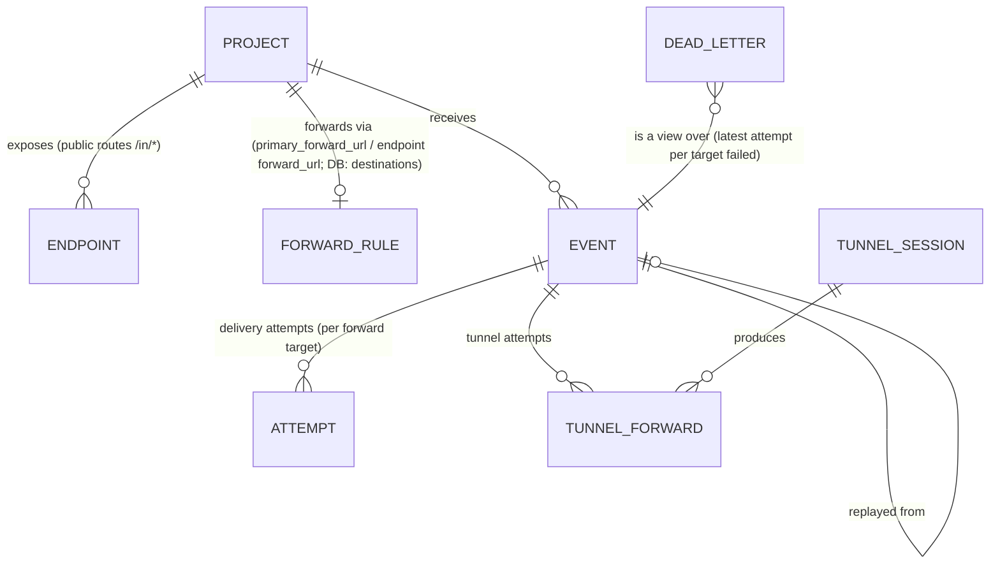
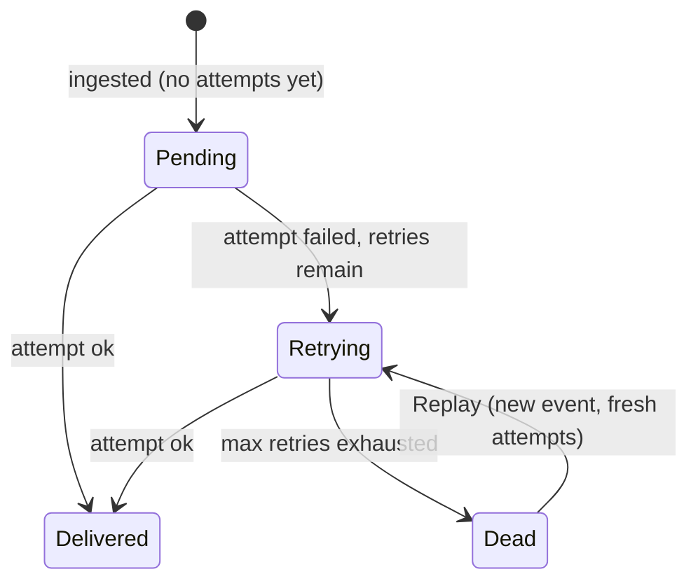

# 05 — Conceptual model (the load-bearing layer)

Technique: walk the existing product (dashboard + worker routes + D1 migrations) to
extract the implicit model, then object definitions, states and a ubiquitous language.
**No backend changes are allowed in this proposition**, so the proposed model must be
expressible with the existing API; anything that is not is marked **provisional**.

## Current (implicit) model — as the product presents it

```mermaid
erDiagram
  PROJECT ||--o{ ENDPOINT : "has (UI: 'endpoints')"
  PROJECT ||--o{ EVENT : "receives"
  EVENT ||--o{ ATTEMPT : "delivery attempts"
  ATTEMPT }o--|| DESTINATION_DB : "belongs to (hidden in UI)"
  PROJECT ||--o{ TUNNEL : "tunnels (scoped by slug)"
  TUNNEL ||--o{ TUNNEL_ATTEMPT : "forwards (per event)"
  DEAD_LETTER }o--o EVENT : "derived on the fly, per selected event only"
```

Failure modes (OOUX):
- **Masked:** the UI's "endpoint" (`project_endpoints`, public `/in/{path}` routes) and
  the DB's `destinations` (forwarding rules with retries/transforms) are two objects
  sharing one name; the second is invisible in the dashboard. *(observed-in-product)*
- **Isolated / no place:** the dead-letter — "did this event permanently fail?" —
  exists only as red rows inside whichever event you have selected. There is no view
  of "everything currently failing" even though `delivery-health` and
  `topFailingDestinations` metrics exist. *(observed-in-product)*
- **Lie by omission:** an event with all attempts failed and an event fully delivered
  look identical in the stream (same `Live`/`Replay` + method chips). Delivery outcome
  is not a property of the event row. *(observed-in-product)*
- **Shapeshifter:** the project is a `<select>` in the toolbar, the de-facto root of
  every query, and a settings workspace — but it has no address; switching it
  silently mutates whatever you were looking at. *(observed-in-product)*

## Proposed model



### Object definitions

| Object | One sentence (user's view) | Key attributes | Actions |
|---|---|---|---|
| **Project** | A webhook namespace I run: slug, routes, keys, retention. | slug, name, retention, plan, primary forward URL | Create, rename, archive, switch (navigates) |
| **Endpoint** | A public route I hand to a provider: `/in/{path}`. | path, name, forward URL, active | Create, edit, delete, copy URL |
| **Forward rule** *(proposed name for DB `destinations`)* | Where events go after ingestion: URL, condition, transform, retry budget. | url, condition, transform, timeout, max retries, active | (provisional — not yet a dashboard object; see below) |
| **Event** | One received webhook, stored verbatim. | id, method, endpoint path, query, payload, received_at, replay-of | Inspect, copy id, replay |
| **Attempt** | One delivery try of an event to one forward target. | target, attempt_no, status code, success, error, duration | Inspect |
| **Dead letter** | An event whose latest attempt to some target failed — the thing I need to act on. | event + failed targets + errors + age | Open event, Replay |
| **Tunnel session** | My laptop connected to the cloud for local dev. | device, target URL, status (live/idle/stale), counters | Inspect, disconnect |
| **API key** | A credential for scripts/CI. | label, fingerprint, created, revoked | Create, rotate, revoke |

**Can-be-an-object ≠ should-be-first-class.** *Forward rule* is a real domain object
(retries, transforms, conditions — `destinations` table) but is currently managed
indirectly through endpoints and the primary forward URL; promoting it gets a
**provisional** marker and no UI in this pass. *Replay* is a verb and a lineage
attribute (`replay_of_event_id`), not a place. *Tunnel attempt* is evidence inside an
event, not a top-level object.

### Event delivery state (per forward target, derived from attempts)



Naming decisions:
- Intermediate state shown quietly as **Retrying** (attempt_no visible), never "failed"
  while retries remain — matches `deliverWithRetries` backoff loop. *(observed-in-product:
  the workflow retries up to `max_retries` with exponential backoff)*
- **Dead** is the honest word for "latest attempt failed"; the UI's list of these is
  the **Dead letters** place. Semantics implemented client-side: group attempts by
  target, event is dead-lettered iff the *latest* attempt of *any* target failed.
  **Provisional:** a worker-side `failed-events` query would make this exact and cheap.
- **Delivered shows nothing** on the event row; failure is the only signal worth ink.

## Ubiquitous language

| Term | Chosen | Rejected / current | Why |
|---|---|---|---|
| public route | **Endpoint** (kept) | — | Matches UI + `project_endpoints`; the collision is with *destination*, which gets its own name |
| forwarding target | **Forward rule** *(provisional)* | destination (DB only), endpoint (conflated) | Frees "endpoint"; describes what it does |
| permanently failed delivery | **Dead letter** | failed attempt, error | README already says "dead-letters"; DLQ is the industry term triagers search for |
| received webhook | **Event** | webhook, payload, request | Matches API/DB |
| delivery try | **Attempt** | retry (that's the whole loop), delivery | Matches API/DB |
| local dev connection | **Tunnel** | relay (CLI name) | "relay" is the platform's verb; a session is a tunnel |
| top-level home | **Events** (place) | dashboard, triage | Named for the object it holds |
| again-from-storage | **Replay** (verb) | resend, redeliver | Matches API/CLI |
