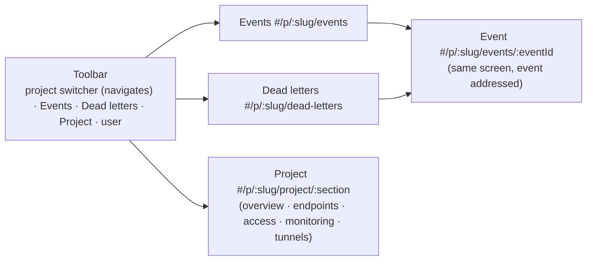

# 06 — Interaction structure & flow

## Current places (as built)

```mermaid
graph LR
  subgraph "/ (single page, all view state local)"
    T["Toolbar<br/>project <select> · Events/Project tabs · user"]
    S["Project summary strip"]
    F["Filter toolbar"]
    TRI["Events triage<br/>stream + detail (selected event = local state)"]
    PR["Project workspace<br/>overview/endpoints/access/monitoring/tunnels (local state)"]
  end
  T -. "?tab=events|project&section=…" .-> URL["URL via replaceState only<br/→ back button exits the app"]
```



*(observed-in-product, `DashboardApp.tsx`)*

Findings:
- **No per-project URL.** The project is a `<select>`; switching mutates the current
  view in place. Two projects cannot be bookmarked, compared or shared. `?tab=` is
  synced but the project id never is.
- **No per-event URL.** The selected event (the thing you are debugging, the thing you
  paste to a teammate or into an issue) is `selectedEvent` local state. Deep links are
  impossible — in a debugging tool.
- **Back is broken by design.** `replaceState` means every "navigation" overwrites
  history; Back leaves the site.
- **Dead letters have no place.** To find failures you eyeball the stream, click
  events one at a time, and read the Attempts section of each. The only cross-event
  failure signal lives in metrics (counts), not evidence (rows).
- **View state resets silently.** Switching project clears events, selection, keys,
  endpoints, tunnels (`useEffect` on `selectedProjectId`) with no navigational trace.

## Proposed places



Navigation decisions:
- **Hash routing, zero dependencies.** `#/p/{slug}/…` keeps static hosting and the
  Cloudflare Pages deploy untouched; a router library is not warranted at this size.
- **Every piece of state that answers "what am I looking at" is in the URL**: project
  slug, place, selected event, project section. Back/forward work (pushState, not
  replaceState).
- **Three places per project, one verb.** Events (the stream), Dead letters (the
  failure queue), Project (settings). *Replay* stays a verb available wherever an
  event is addressed.
- **Project switch preserves place.** Selecting another project navigates to the same
  place under the new slug (`events → events`, `dead-letters → dead-letters`, …) —
  comparison becomes two tabs.
- **Dead letters address the event, not a copy.** A row links to
  `#/p/:slug/events/:eventId` so triage always lands in the full event context
  (payload + attempts + tunnels) with Replay one keystroke (`R`) away.
- **Legacy `?tab=` URLs still work**, translated once on load to the equivalent hash
  place.

## Breadboards

### Triage a failure (J2)
```
Dead letters  #/p/:slug/dead-letters
- scan of recent events' attempts (bounded, cached) → rows: event id, endpoint,
  failed target(s) with status/error, age
- row → Event #/p/:slug/events/:eventId
- [ post-action: full context — payload, attempts, tunnel forwards ]
- Replay (button or R) → new event appears at top of stream; dead letter clears
  when the fresh delivery succeeds
empty → "No dead letters in recent events" + note that scan covers the newest N
```

### Share evidence (J1/J3)
```
Events #/p/:slug/events
- click event → URL becomes #/p/:slug/events/:id (no reload, no history spam beyond one entry)
- copy id → paste URL + id anywhere; opening it restores project, place and event
```

### Local dev (J4)
```
Project #/p/:slug/project/tunnels
- live tunnel card (device, counters, last error)
- Disconnect → card updates
empty → CLI hint (existing, kept)
```

### Administer (J5)
```
Project #/p/:slug/project/{section}
- sections as addressed sub-places (deep link to .../endpoints, .../access, ...)
- New project → dialog → navigates to the new project's Events
```

## Open decisions
- Dead-letter scan is client-side over the newest ~25 events (N+1 attempts calls,
  cached). **Provisional** — the right fix is a worker endpoint; noted in `decisions.md`.
- No dead-letter *count badge* in the toolbar for the same cost reason; revisit with
  the worker endpoint.
- Event filters (query, time range, replay-only) stay local state, not URL params —
  they modify a list, not "what am I looking at". Revisit if sharing filtered views
  is asked for.
